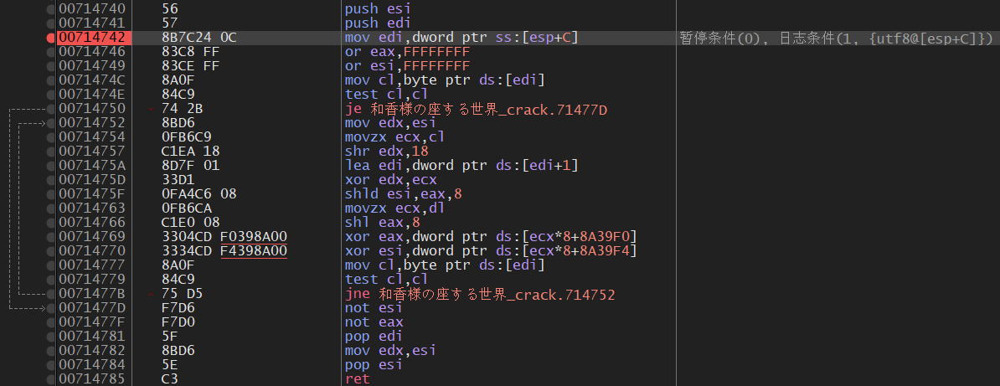

# 解包游戏「和香様の座する世界」

## 使用方法

```shell
$ g++ ./src/main.cpp -o main.exe -lz -fexec-charset=GBK
```

然后将每个【script.dat】或【arc.dat】文件拖入main.exe即可，提取出的文件保存在out文件夹中。

语音，BGM，CG等文件需要key才能解密，这里的key是文件封包时的相对路径。



C了个全CG，但是从上图位置提取的key好像不全，不过大部分CG应该都有了。

# 参考

https://github.com/Forlos/vn_re/tree/master/docs/acv1